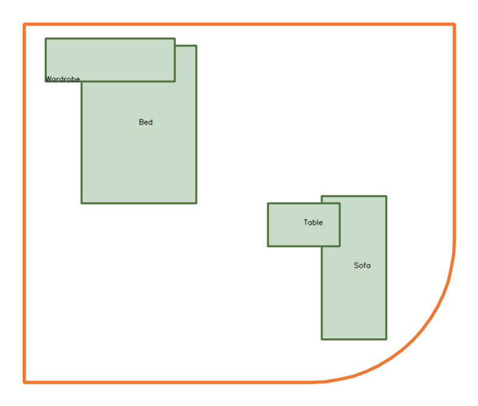
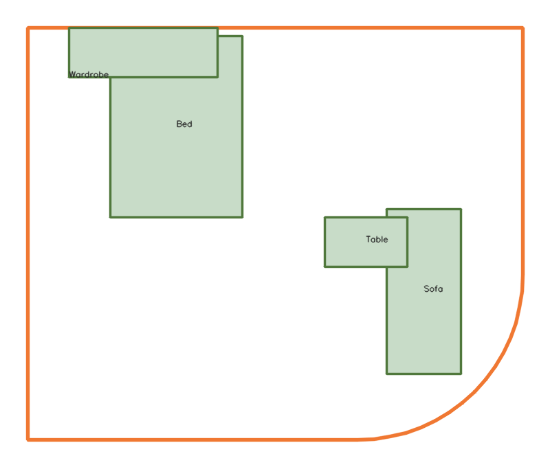

# Project Progress Report

## 1. Problem Description

The indoor layout planner seeks to generate room arrangements that are functionally acceptable rather than mathematically optimal. Given a floor outline and a catalogue of furnishings, the system must avoid two failure

1. Crowding furniture into dense clusters;  
2. Pushing every object tightly against the walls.

The system should maintain **walkable circulation** while achieving layouts that feel natural and livable.  
Our current research explores a hybrid formulation combining **hard spatial constraints** with **light-structure rules** and a **saturated utility score**, ensuring the search process maintains diversity and converges toward “good enough” configurations that balance openness, comfort distance, and accessibility.

## 2. Solution

GitHub: [synthetic-indoor-layout-planner (dev branch)](https://github.com/gqysmart/synthetic-indoor-layout-planner/tree/dev)

### 2.1 Architecture and Framework

| |  | |
|:--:|:------:|:--:|

- **Geometry layer**: Python models (`room.py`, `furnishings.py`) represent room boundaries via connected line/arc segments and furniture footprints with anchors, rotations, and safety checks; randomised factory helpers speed up prototyping.
- **Data ingestion**: `floor_extractor.py` scans JSON floor plans and isolates the `floor` node, giving the planner normalized input.
- **Rendering utilities**: `CVRender` inside `room.py` produces OpenCV sketches for fast visual debugging and exports snapshots such as `outputs/sample_room_cv_5.png`.
- **Planned service shell**: The backend will expose the planner through a lightweight REST layer (FastAPI skeleton), keeping the core solver independent of transport so it can back the web front-end or batch experiments.

### 2.2 Model Evolution

The reasoning process is documented in [specs/process.md](../specs/process.md).

1. **Stage 1 – Hard CSP core**: Enforce boundary containment, clearance-inflated non-overlap, and 0.6 m minimum path width from the door to every furniture item using discrete translation/rotation moves.
2. **Stage 2 – Single objective**: Maximize the largest connected free area `A_free(L)` relative to a wall-anchored baseline; this highlighted the tendency to over-fit “everything-on-walls” solutions.
3. **Stage 3 – Utility with light structure**: Blend the hard constraints with quota-based wall contact, interior-band occupancy, dispersion penalties, and functional distance rewards. A saturated utility function (ceiling at 0.8·baseline free space) ensures open layouts are rewarded without forcing every piece to hug the boundary.
4. **Search strategy**: Beam search and large-neighborhood search (LNS) over curated anchor sets (wall band, interior band, functional anchors) allow anytime improvement and support diversity between near-wall and island-centric configurations.

## 3. Completed Work

- Defined wall-band, interior-band, and free-area terminology, establishing the metrics that guide constraint checks and scoring.
- Implemented room and furniture data classes with validation, area/volume helpers, rotation-aware footprints, and human-readable inspectors.
- Built a JSON floor extractor plus OpenCV rendering utilities to iterate quickly on sample layouts and capture visual outputs for reviews.

    ```bash
    python examples/show_room_cv.py --iterations=5

<!-- markdownlint-disable MD033 -->

<!-- <figure style="display:inline-block; margin-right:2%; text-align:center;">

<figcaption>图 1. 迭代 1 结果</figcaption>
</figure>
<figure style="display:inline-block; text-align:center;">

<figcaption>图 2. 迭代 5 结果</figcaption>
</figure> -->

<!-- markdownlint-enable MD033 -->

|  |  |
| :---: | :---: |
| caption 1. iteration1 | caption 2. iteration5 |

## 4. Next Steps

- Translate the staged model into executable constraints and scoring functions, starting with `S_area`, wall quotas, and interior occupancy checks.
- Implement the beam/LNS search loop that orchestrates anchor sampling, constraint validation, and incremental utility gains.
- Expose solver endpoints through the FastAPI layer and connect them to the existing frontend scaffold for interactive testing.
- Add automated regression tests around geometry validation, free-area calculations, and utility scoring once the metrics solidify.
