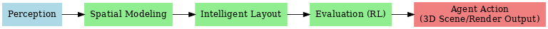

# Project Proposal / 项目说明文档

## 📌 Project Theme / 项目主题
**Interior Layout Intelligent Planning System / 室内布局智能规划系统**  

This project applies **search, planning, constraint satisfaction, and reinforcement learning** to automate indoor furniture layout and navigation.  
本项目旨在结合人工智能的 **搜索、规划、约束满足与强化学习** 方法，解决室内家具布局与导航的自动化问题。  

---

## 🎯 Course Relevance / 课程相关性
- **Search & Planning / 搜索与规划** → A* algorithm for path planning / 使用 **A\*** 算法实现路径规划  
- **State Modeling / 状态建模** → Grid-based representation of room and furniture / 将房间与家具建模为网格化空间  
- **Constraint Satisfaction / 约束满足** → Collision checks and corridor width rules / 碰撞检测、通道宽度等空间规则  
- **Reinforcement Learning / 强化学习** → Q-learning agent learns navigation strategies / Q-learning agent 学习导航策略  
- **Visualization / 可视化** → 2D top-down display & demo video / 输出 2D 俯视图与演示视频  

👉 The project fully meets the course requirements.  
👉 项目完全覆盖课程要求，确保学术目标达成。  

---

## 🔄 System Structure / 系统结构

The system has 3 layers and 5 modules:  
系统分为三个层次，共五个模块：  

1. **Perception / 感知**: Extract room and furniture info from images or synthetic data (simplified to manual JSON in course phase).  
   从图像/虚拟场景提取房间和家具信息（课程阶段可简化为手工 JSON）。  
2. **Spatial Modeling / 空间建模**: Build occupancy grids and states.  
   生成栅格/占用图，提供统一状态表示。  
3. **Intelligent Layout / 智能布局**: Generate or validate furniture layout with A* and rules.  
   基于 A* 和约束规则生成/验证家具摆放方案。  
4. **Evaluation (RL) / 评估系统**: Use Q-learning for navigation and performance evaluation.  
   通过 Q-learning 导航任务验证 agent 学习效果。  
5. **Agent Action / 行为输出**: Output 2D visualization; extended to 3D or rendered images.  
   输出结果为 2D 可视化，扩展阶段可导出 3D 场景或渲染图。  

---

## 🗓 Project Phases / 阶段目标  

### Phase 1 (Course, 2.5 months) / 阶段 1（课程周期内，2.5 个月）  
- State modeling, A* search, constraint satisfaction  
- Q-learning navigation, 2D visualization  
- Submit code, demo video, and technical report  
- 完成 **状态建模、A\* 搜索、约束满足、Q-learning、2D 可视化**  
- 提交代码、演示视频、技术报告  

### Phase 2 (Extension, after course) / 阶段 2（课程后扩展）  
- Perception (YOLO + UnrealCV synthetic data)  
- Layout search & robustness analysis  
- 3D scene or rendering for portfolio  
- 加入感知模块（YOLO + UnrealCV）  
- 实现布局搜索与鲁棒性分析  
- 输出 3D 场景或渲染图，用于作品集  

---

## ✅ Feasibility / 可行性保障
- **Controlled difficulty / 难度控制**: Course phase uses pre-trained YOLO or manual JSON.  
- **Time management / 时间可控**: Core modules split into 4–5 clear steps within 2.5 months.  
- **Scalable design / 扩展潜力**: Modular architecture allows future research & startup extension.  

---

## 🙏 Request / 请求
I kindly ask for your confirmation whether this plan fits the course requirements, and for any advice on further improvement.  
希望您能确认该方案是否符合课程要求，并提出进一步建议。  

**Best regards / 此致敬礼**  
[Your Name / 你的名字]  
