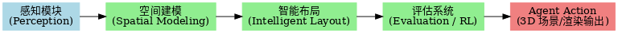

# 室内布局智能系统的五大模块（规格说明）



## 🔄 总体结构

    (1) 感知 Perception
       └─ 检测/深度/重建 → 标准化房间与家具信息 (room.json)
            ↓
    (2) 空间建模 Spatial Modeling（状态建模）
       └─ 栅格/占用图/通道膨胀/几何约束 → State
            ↓
    (3) 智能布局 Intelligent Layout（约束优化/搜索）
       └─ A* / 束搜索 / 模拟退火 / 规则检查 → 候选布局
            ↓
    (4) 评估系统 Evaluation（强化学习 + 指标）
       └─ Q-learning/DQN 训练 & 指标打分 → 最优策略/评分
            ↓
    (5) Agent Action（输出）
       └─ 导出 3D 场景（Unreal/GLTF）或高清渲染图

------------------------------------------------------------------------

## 1) 感知模块 Perception

**目标**：从图像/视频/虚拟场景提取可计算的房间与家具信息。\
**输入**：照片/视频 或 UnrealCV 合成数据。\
**输出**：标准化 `room.json`。

``` json
{
  "room": {"width_m":4.0,"height_m":3.2,"doors":[{"x":0.2,"y":1.6}]},
  "furnitures":[
    {"id":"bed","x":1.0,"y":2.2,"theta":0,"size_m":[2.0,1.5]},
    {"id":"desk","x":2.5,"y":1.6,"theta":90,"size_m":[1.2,0.6]}
  ]
}
```

**核心方法**：YOLO 推理、单目深度 (MiDaS/DPT)、多视图
(COLMAP/UnrealCV)。\
**接口**：`perception_stub.py: images/video → room.json`

------------------------------------------------------------------------

## 2) 空间建模 Spatial Modeling

**目标**：将 `room.json` 转为可计算的空间状态。\
**输入**：`room.json`。\
**输出**：`State`（网格/占用/通道/POIs）。

``` python
State = {
  "grid": np.ndarray(H,W),
  "furnitures": [{"id":"desk","x":24,"y":16,"theta":90,"size":[12,6]}],
  "meta": {"resolution":0.1, "min_clearance":0.8},
  "pois": [{"name":"desk_front","x":26,"y":16}]
}
```

**核心方法**：栅格化、占用图、通道膨胀。\
**接口**：`state.py: room.json → State`

------------------------------------------------------------------------

## 3) 智能布局 Intelligent Layout

**目标**：在空间与规则约束下生成可行且更优的布局方案。\
**输入**：`State`。\
**输出**：候选布局 + 对应路径。

**核心方法**：\
- 规则/约束：无重叠、通道宽度、靠墙/离窗距离。\
- 搜索/优化：束搜索 (beam search) / 模拟退火。\
- 路径验证：A\* 路径长度计入评分。

**接口**：`layout_planner.py: State → [layouts]`

------------------------------------------------------------------------

## 4) 评估系统 Evaluation

**目标**：通过 RL 与指标对候选方案进行评价。\
**输入**：`State` 或候选布局。\
**输出**：最优策略/指标报告。

**核心方法**：\
- RL 导航：Q-learning，奖励=到达+1/碰撞-1/步长-0.01。\
- RL 布局（扩展）：动作=移动/旋转，奖励=可达率+通道宽度+紧凑度。

**指标**：可达率、平均最短路、通道宽度、RL 成功率、运行时。\
**接口**：`rl_env.py / q_learning.py`

------------------------------------------------------------------------

## 5) Agent Action 输出模块

**目标**：将结果转为展示与交付形式。\
**输入**：最优布局 + 路径。\
**输出**：3D 场景或高清渲染图。

**方法**：\
- UnrealCV/蓝图批量导出 PNG/JPG/MP4。\
- Open3D/three.js 快速 3D 预览。

**接口**：`export_scene.py: layout → {gltf, fbx, png, mp4}`

------------------------------------------------------------------------

## 📈 CLI 调用顺序

``` bash
python run.py --mode perception --input assets/room.jpg
python run.py --mode state --config configs/config.yaml
python run.py --mode layout --beam_width 8
python run.py --mode astar --start 2,16 --goal 24,16
python run.py --mode rl_nav --episodes 2000
python run.py --mode export --format gltf --shots top,iso,path
```
